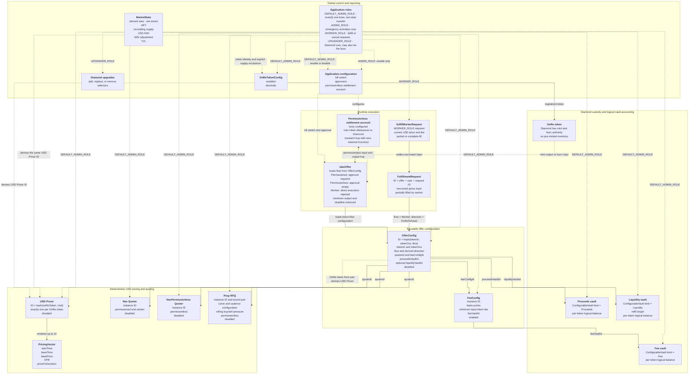

# Offer, pricing, and quoting architecture

Status: Implemented for fresh Diamond deployments.

This is the EVM form of the Solana account model. A `bytes32` deterministic ID
replaces a PDA address, operational vault balances remain in Diamond custody,
and facets are thin adapters over namespaced Diamond storage.

Every application facet declares its own external ABI. Gemforge generates the
aggregate client interface, `src/generated/IDiamondProxy.sol`, from those facet
sources, and derives deployment and upgrade cuts from the same ABIs.

The implemented scope intentionally contains:

- one pricing denomination: `Usd`;
- three offer flows: `Permissioned`, `Permissionless`, and `Worker`;
- two stateless quoter kinds, `Nav` and `NavPermissionless`, plus the stateful
  proprietary request-for-quote kind, `PropRfq` (Prop RFQ);
- no Buffer state or execution;
- no separate redemption-offer configuration.

## Domain graph



## Deterministic identities

The EVM IDs mirror the proposed PDA seed boundaries:

```text
USD Pricer         = hash("onre.pricer", onReToken, Usd)
Quoter             = hash("onre.quoter", kind, instanceId)
FeeConfig          = hash("onre.fee_config", instanceId)
ConfigurableVault  = hash("onre.configurable_vault", kind, instanceId)
OfferConfig        = hash("onre.offer_config", tokenIn, tokenOut, flow)
FulfillmentRequest = hash("onre.fulfillment_request", offerConfigId, user, requestId)
```

For Quoters, `kind` selects the behavior family and `instanceId` selects one
independently configurable instance within that family. Multiple `Nav`,
`NavPermissionless`, or `PropRfq` instances can therefore coexist.
Kind-specific settings are stored under the resulting `quoterId`; mutable
settings are not included in the identity hash.

Every kind is first created through `createQuoter(kind, instanceId)`. Quoter
kinds with additional state then expose a typed configuration function. For
`PropRfq`, `configurePropRfq` binds the pair on its first call and updates
only the mutable curve, cadence, and wall settings on later calls. An
unconfigured `PropRfq` cannot be assigned to an OfferConfig.

A `PropRfq` proprietary request-for-quote instance is immutably bound to one
asset and one OnRe token.
Multiple instances may use the same pair while keeping independent curve
configuration and rolling pressure. The asset-to-OnRe and OnRe-to-asset
permissionless `OfferConfig`s may reference the same instance, which makes buys
relieve the sell pressure accumulated by that instance.

There is exactly one `OfferConfig` for a directed pair and flow. Permissioned
and permissionless routes for the same pair therefore cannot silently share an
authorization mode. A reverse route is a different directed pair.

Direction is derived from which token is a registered OnRe token:

```text
tokenOut is registered OnRe -> AssetToOnRe
tokenIn  is registered OnRe -> OnReToAsset
both or neither             -> reject
```

`tokenIn`, `tokenOut`, `flow`, and `direction` are immutable. The referenced
Quoter, FeeConfig, and vaults can be replaced by governance while preserving
the route identity. The USD Pricer is derived from the route's OnRe token and
cannot be redirected independently.

## Compatibility matrix

| Flow | Direction | Required quoter | Execution |
| --- | --- | --- | --- |
| `Permissioned` | either | `Nav` | `takeOffer`; valid approver signature required |
| `Permissionless` | either | `NavPermissionless` | `takeOffer`; approval fields must be empty |
| `Permissionless` | either | pair-matching `PropRfq` | `takeOffer`; approval fields must be empty |
| `Worker` | `OnReToAsset` | `Nav` | create, partially fulfill, or cancel a `FulfillmentRequest` |

The two NAV quoter kinds use the same arithmetic but remain separate
dispatch families so permissionless quoting can evolve without changing
permissioned or worker behavior. `PropRfq` uses the same NAV result for buys.
For sells it applies the configured liquidity, pressure, curve, and cadence
dampening after the NAV result.

`takeOffer` loads the flow, direction, and Quoter from the selected
`OfferConfig`, then derives the single USD Pricer from the route's OnRe token.
The caller does not choose an execution path or Pricer independently of that
configuration. Permissioned offers require the embedded approval message and
signature. Permissionless offers require both to be empty. Worker offers reject
direct execution and use the escrowed fulfillment-request path.

Permissioned execution transfers input from the user to the Diamond and output
from the Diamond or mint directly to the user. Permissionless execution instead
uses the globally configured settlement account for both token legs:

```text
input:  user -> settlement account -> Diamond
output: Diamond or mint -> settlement account -> user
```

The settlement account must pre-approve the Diamond for every supported token.
Both legs are atomic, exact-transfer checked, and leave no trade inventory in
the settlement account. Worker fulfillment remains direct and does not use it.

Every direct execution also carries `minimumAmountOut` and `deadline`. Settlement
reverts before collecting input when the current quote is below the caller's
minimum or the deadline has expired.

`previewExecution(offerConfigId, grossInputAmount)` is the canonical
user-facing quote. It returns the gross input, fee, net input, price, and final
output using the same path as execution.

## Quote and settlement rules

The Pricer returns USD-denominated price `P` per OnRe token:

```text
asset -> OnRe: amountOut = normalizedNetInput / P
OnRe -> asset: amountOut = normalizedNetInput * P
```

Every fee is charged in the input token:

```text
percentageFee = ceil(grossInput * basisPoints / 10_000)
fee           = max(percentageFee, minimumFeeAmount)
netInput      = grossInput - fee
```

`minimumFeeAmount` is denominated in the offer input token's smallest unit.
Set it to zero when the fee configuration should have no absolute floor. Since
the floor is token-denominated, an offer must reference a fee configuration
that is appropriate for its input token.

The Prop RFQ configuration stored per quoter instance is:

- curve peg haircut in basis points;
- curve exponent scaled by `10_000`;
- sell cadence threshold and maximum cadence wave;
- rolling epoch duration;
- dynamic-wall sensitivity.

Each instance also stores current sell value, current buy value, previous net
sell value, current sell count, and epoch start. Successful buys add their net
asset input to buy value. Successful sells add the raw pre-curve asset output
and increment the sell count. State is updated before external token calls and
the entire update rolls back if settlement fails.

For a Prop RFQ sell, the raw NAV output is first checked against actual
Liquidity-vault balance. The configured Liquidity vault's TVL refill target, if
nonzero, caps the hard-wall reserve:

```text
hardWallReserve   = min(actualLiquidity, TVL * refillTargetBps / 10_000)
effectivePressure = decayedPreviousNetSells + currentNetSells + rawSellOutput
dynamicWall       = actualLiquidity / (1 + sensitivity * effectivePressure / actualLiquidity)
effectiveLiquidity = min(dynamicWall, hardWallReserve)
utilization       = rawSellOutput / effectiveLiquidity
haircut           = max(pegHaircut * utilization^exponent, cadenceTarget)
amountOut         = rawSellOutput * max(0, 1 - haircut)
```

All curve operations use integer fixed-point arithmetic. The fractional-power
approximation and cadence vectors match the corresponding Solana implementation.

For `AssetToOnRe`, the Diamond collects the input asset, accounts the fee in the
Fee vault, refills the configured Liquidity vault up to its TVL target, accounts
the remainder in the Proceeds vault, and mints the quoted OnRe output. For a
permissionless offer the mint recipient is the settlement account, whose
allowance lets the Diamond transfer the output to the user. The Diamond must
have the OnRe token's mint authority; no pre-minted inventory is involved.

Minted OnRe supply is circulating unless its holder is explicitly configured as
an excluded-supply address.

For `OnReToAsset`, the Diamond pulls or has already escrowed the OnRe input,
accounts the input fee, burns the net input, debits the configured Liquidity
vault, and transfers the asset output. Permissionless execution sends that
output through the settlement account before it reaches the user.

Every token transfer used by deposits, settlement, vault withdrawal, and
request cancellation verifies both sides of the balance change. The sender
must lose exactly the requested amount and the recipient must receive exactly
that amount; taxed, rebasing, or otherwise non-exact behavior reverts the full
transaction.

Worker request creation does not lock a price or fee. Every partial fill reads
the current USD Pricer and FeeConfig, then updates `fulfilledInputAmount`.
Cancellation returns only the unfilled input.

## Diamond boundaries

- `DiamondCutFacet` requires `UPGRADER_ROLE`; the boss may also hold that role.
- `diamondCut` routing cannot be removed, so an upgrade cannot accidentally
  delete the only upgrade entry point; replacement remains available.
- `OnRePricerFacet` configures USD Pricers and embedded vectors.
- `OnReQuoterFacet` configures NAV and pair-bound Prop RFQ instances.
- `OnReOfferFacet` delegates FeeConfig policy to `LibOnReFeeConfig`,
  OfferConfig lifecycle to `LibOnReOfferConfig`, and runtime execution to
  `LibOnReOffer`; it also exposes the canonical gross-input execution preview.
- `OnReFulfillmentFacet` owns worker request creation, partial fulfillment, and
  cancellation.
- `OnReConfigurableVaultFacet` owns reusable vault instances, deposits,
  fixed-destination withdrawals, and per-token accounting.
- `OnReMarketStatsFacet` derives canonical circulating supply and TVL while
  consuming price and APR data from the token's USD Pricer.

All facets use `LibOnReStorage`; none declares ordinary mutable state.
