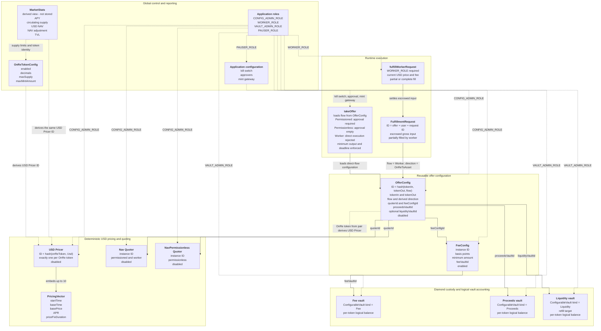

# Offer, pricing, and quoting architecture

Status: Implemented for fresh Diamond deployments.

This is the EVM form of the Solana account model. A `bytes32` deterministic ID
replaces a PDA address, ERC-20 balances remain in Diamond custody, and facets are
thin adapters over namespaced Diamond storage.

The implemented scope intentionally contains:

- one pricing denomination: `Usd`;
- three offer flows: `Permissioned`, `Permissionless`, and `Worker`;
- two stateless quoter kinds: `Nav` and `NavPermissionless`;
- no Buffer state or execution;
- no Prop AMM state or execution;
- no separate redemption-offer configuration.

## Domain graph



## Deterministic identities

The EVM IDs mirror the proposed PDA seed boundaries:

```text
USD Pricer         = hash("onre.pricer", onReToken, Usd)
Quoter             = hash("onre.quoter", kind, instanceId)
FeeConfig          = hash("onre.fee_config", instanceId)
ConfigurableVault  = hash("onre.configurable_vault", kind, instanceId)
OfferConfig        = hash("onre.offer_config", tokenIn, tokenOut, flow)
FulfillmentRequest = hash("onre.fulfillment_request", offerConfigId, user, requestId)
```

For Quoters, `kind` selects the behavior family and `instanceId` selects one
independently configurable instance within that family. Multiple `Nav`,
`NavPermissionless`, or future `PropAmm` instances can therefore coexist.
Kind-specific settings are stored under the resulting `quoterId`; mutable
settings are not included in the identity hash.

There is exactly one `OfferConfig` for a directed pair and flow. Permissioned
and permissionless routes for the same pair therefore cannot silently share an
authorization mode. A reverse route is a different directed pair.

Direction is derived from which token is a registered OnRe token:

```text
tokenOut is registered OnRe -> AssetToOnRe
tokenIn  is registered OnRe -> OnReToAsset
both or neither             -> reject
```

`tokenIn`, `tokenOut`, `flow`, and `direction` are immutable. The referenced
Quoter, FeeConfig, and vaults can be replaced by governance while preserving
the route identity. The USD Pricer is derived from the route's OnRe token and
cannot be redirected independently.

## Compatibility matrix

| Flow | Direction | Required quoter | Execution |
| --- | --- | --- | --- |
| `Permissioned` | either | `Nav` | `takeOffer`; valid approver signature required |
| `Permissionless` | either | `NavPermissionless` | `takeOffer`; approval fields must be empty |
| `Worker` | `OnReToAsset` | `Nav` | create, partially fulfill, or cancel a `FulfillmentRequest` |

The two quoter kinds currently use the same NAV arithmetic but remain separate
dispatch families so permissionless quoting can evolve without changing
permissioned or worker behavior.

`takeOffer` loads the flow, direction, and Quoter from the selected
`OfferConfig`, then derives the single USD Pricer from the route's OnRe token.
The caller does not choose an execution path or Pricer independently of that
configuration. Permissioned offers require the embedded approval message and
signature. Permissionless offers require both to be empty. Worker offers reject
direct execution and use the escrowed fulfillment-request path.

Every direct execution also carries `minimumAmountOut` and `deadline`. Settlement
reverts before collecting input when the current quote is below the caller's
minimum or the deadline has expired.

## Quote and settlement rules

The Pricer returns USD-denominated price `P` per OnRe token:

```text
asset -> OnRe: amountOut = normalizedNetInput / P
OnRe -> asset: amountOut = normalizedNetInput * P
```

Every fee is charged in the input token:

```text
percentageFee = ceil(grossInput * basisPoints / 10_000)
fee           = max(percentageFee, minimumAmount)
netInput      = grossInput - fee
```

For `AssetToOnRe`, the Diamond pulls the input asset, accounts the fee in the
Fee vault, refills the configured Liquidity vault up to its TVL target, accounts
the remainder in the Proceeds vault, and mints the OnRe output through the mint
gateway.

For `OnReToAsset`, the Diamond pulls or has already escrowed the OnRe input,
accounts the input fee, burns the net input, debits the configured Liquidity
vault, and transfers the asset output to the user.

Worker request creation does not lock a price or fee. Every partial fill reads
the current USD Pricer and FeeConfig, then updates `fulfilledInputAmount`.
Cancellation returns only the unfilled input.

## Diamond boundaries

- `OnRePricerFacet` configures USD Pricers and embedded vectors.
- `OnReQuoterFacet` configures quoter instances and exposes quote previews.
- `OnReOfferFacet` configures FeeConfigs and OfferConfigs and dispatches
  `takeOffer` from the configured permissioned or permissionless flow.
- `OnReFulfillmentFacet` owns worker request creation, partial fulfillment, and
  cancellation.
- `OnReConfigurableVaultFacet` owns reusable vault instances, deposits,
  fixed-destination withdrawals, and per-token accounting.
- `OnReMarketStatsFacet` derives reporting from the token's canonical USD
  Pricer.

All facets use `LibOnReStorage`; none declares ordinary mutable state.
